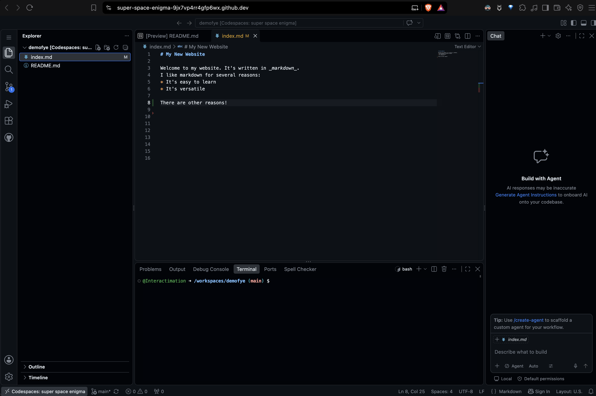

# Getting Started with Github

This workflow works on **Windows, Mac, and Chromebook** and requires no software installation.

------

## Create a GitHub Repository

1. Go to [GitHub](https://github.com) and create a sign in (if you don't have one already!)
2. Click **New repository**.
3. Give the repository a name.
4. Set it to **Public**.
5. Check **Add a README file**.
6. Click **Create repository**.

### Create Your Web Page

1. In the repository, click **Add file → Create new file**.
1. Name the file:

   `index.md`

1. in the repo press the `.` (period) key —an editor will fills the screen

1. Add some Markdown:

   ```markdown
   # My Markdown Test

   This is a paragraph.

   ## A Subheading

   Here is **bold**, *italic*, and a [link](https://github.com).

   - Apples
   - Oranges
   - Lemons

### Preview Your Markdown

To preview the page:

**Windows / Chromebook**

`Ctrl + Shift + V`

**Mac**

`Cmd + Shift + V`

To go back into edit mode just click the page name (index.md) in the left sidebar

Now can edit the Markdown and preview the result before publishing it.

### Save Your Changes

1. Click **Commit changes**.
1. Commit the file to the `main` branch.

------

## Create Your Website

* Open **Settings** for the repository.

* Select **Pages**.

* Under **Build and deployment**, choose:

   * **Source:** Deploy from a branch
   * **Branch:** `main`
   * **Folder:** `/(root)`

* Click **Save**.

* Refresh the **Pages** settings page after a moment.

GitHub will display your site address:

`https://YOUR-USERNAME.github.io/YOUR-REPOSITORY/`

* Copy that url and go to your repo. On the right hand side in the About box, click the gear icon. Paste the URL into the _Website_ field and Save your changes —now you can always get to your website from your repo!

### Open the Browser-Based Editor

After you've admired your very first website (or your first GitHub Pages website) return to the main page of your repository

* Click the Green "Code" button
* Instead of "local", choose "Codespaces" and
* Select "Create codespace on main" (this opens a new tab and takes a minute to set up but tell it to "Trust" when the option appears)

You should eventually see something like this:


### How to Use the Editor

* On the left, click the "documents" icon
* Select index.md
* In the middle of the screen, type changes to the index page
* When done, on the left, click the Source Control icon (paths branching between circles)
* Type something in the "Changes" field _above_ the Commit button
* Hover over the Changes dropdown _below_ the Commit button and click the + sign that appears there
* _Click_ the Commit button
* Click the Sync changes button when it appears
* In a few seconds your changes will appear on your site!

> **NOTE:** You can just close the editor tab, though if you end up with several repos, you may want to _stop_ the editor, as there's a limit to how many you can have running, so…

## To Stop or Start your Editor

* Go to your repo
* Click the green Code button and choose Codespaces
* Under "On current branch" you'll see the randomly generated name of your editor and to the right three dots, click them
* Choose "Stop codespace" to stop the editor or "Open in Browser" to restart or reopen it

## View Your Website

Return to:

`https://YOUR-USERNAME.github.io/YOUR-REPOSITORY/`

Refresh the page.

Your Markdown changes should now appear on the website (it will take a couple minutes)

------

### The Basic Workflow:

**Edit Markdown → Preview → Commit → View Website**

------

> **EXTENSIONS:** Spell Checker or other add-ons are available for your editor. Below are instructions for adding spell-checking and you may find them useful for finding and applying other extensions...

## Spell Checker

* With your Codespace editor running, on the left, click the Extensions icon (four boxes)
* Type "Code spell checker" into the field at the top
* Chose and install the Extension

Now misspelled words should get a squiggly underline!
